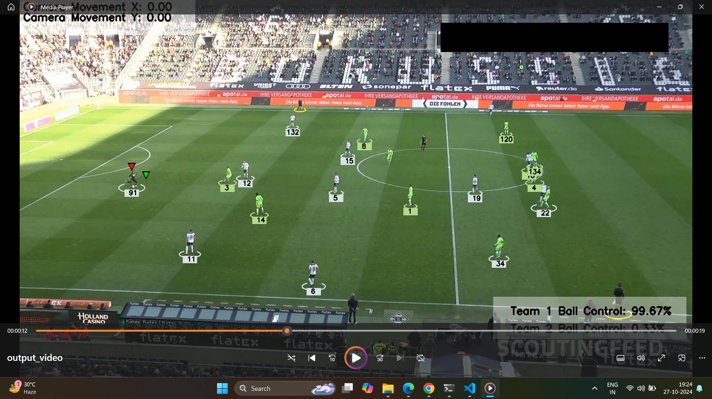

# Football-Analysis-System

## Introduction


The Football Analysis System is a comprehensive project designed to detect and analyze players, referees, and footballs in video footage using the YOLO object detection model. The project also aims to measure important game statistics like team ball possession, player movement, and speed using various computer vision techniques, including KMeans clustering, optical flow, and perspective transformation.

## Project Features
- Player and Object Detection: Detects and tracks players, referees, and footballs in real-time      using YOLO.
- Team Classification: Uses KMeans for pixel segmentation to differentiate teams based on t-shirt 
  color.
- Ball Possession Analysis: Calculates each team’s ball acquisition percentage.
- Camera Motion Analysis: Utilizes optical flow to track camera movement for frame-by-frame 
  analysis.
- Perspective Transformation: Enables measurement of distances in meters for accurate tracking of 
  player movement.
- Player Speed and Distance Metrics: Calculates individual player speed and distance covered.
  Technologies Use

## Technologies Used
- YOLO: Real-time object detection model.
- OpenCV: Computer vision library for image and video processing.
- KMeans Clustering: Used for team classification based on color.
- Optical Flow: Tracks camera motion between frames.
- Perspective Transformation: Provides depth and real-world measurement adjustments.

## Installation

1. Clone the repository:
   ```sh
   git clone https://github.com/princ0301/Football-Analysis-Using-YoloV5.git
   cd Football-Analysis-Using-YoloV5
   ```
2. Install dependencies:
   ```sh
   pip install -r requirements.txt
   ```
## Usage

1. Place the video file in the input_vidoes folder.
2. Run the main script:
   ```sh
   python main.py
   ```
3. Results and analysis data will be generated and saved in the output_vidoes directory.

## Results and Metrics
- Player Detection: Bounding boxes around each player and referee.
- Ball Possession: Percentage display of team ball possession.
- Player Movement: Distance and speed metrics for each player.
- Visualizations: Perspective-corrected view of player locations in meters.

   
